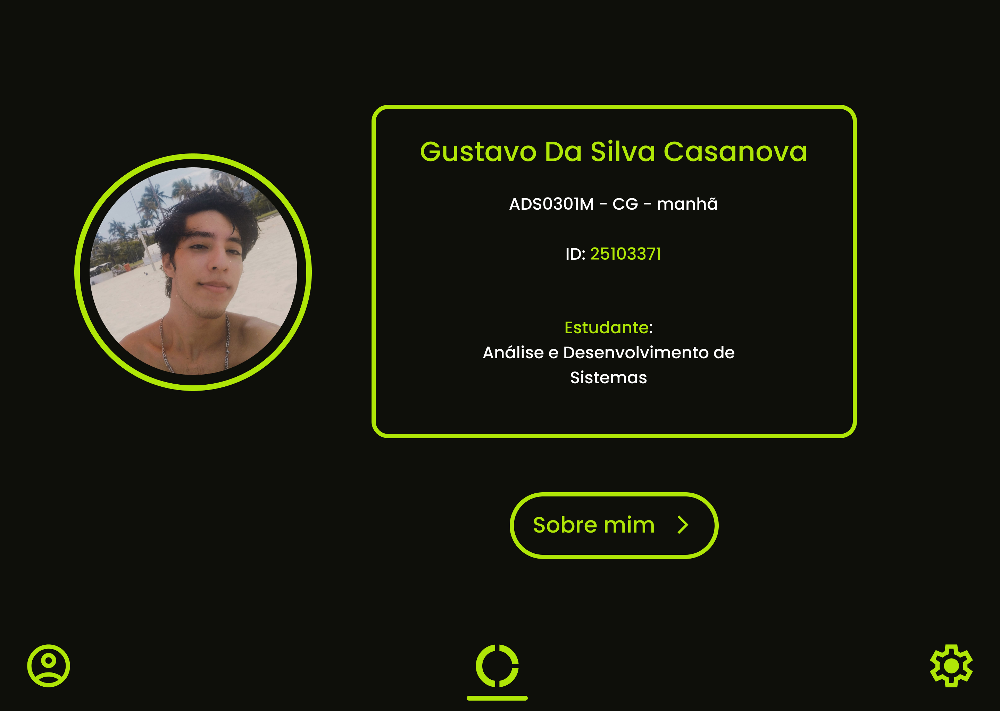
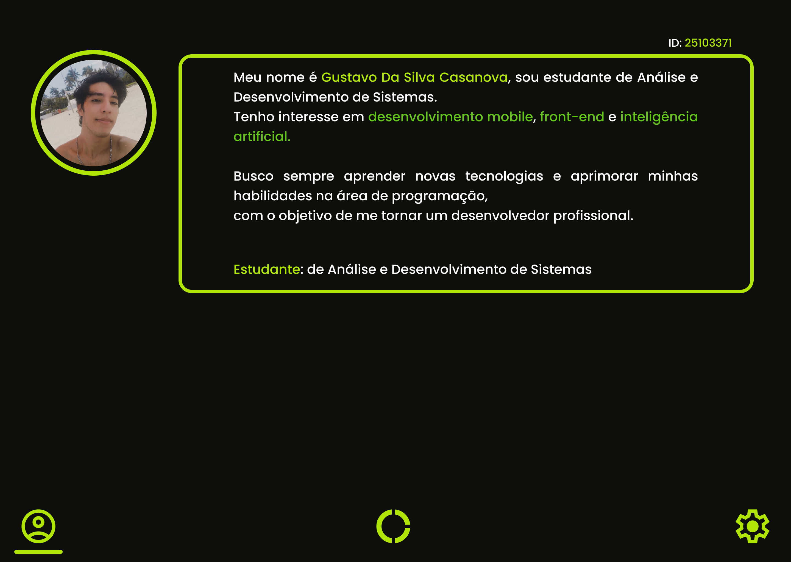
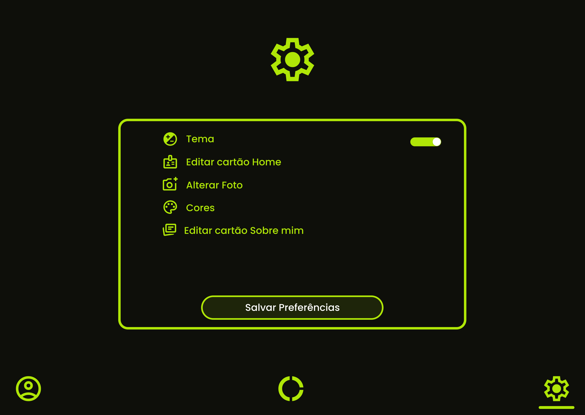
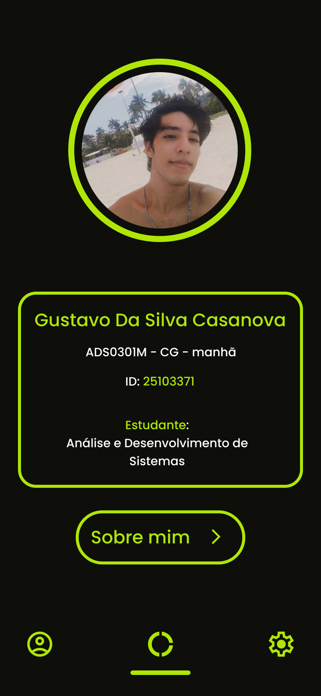
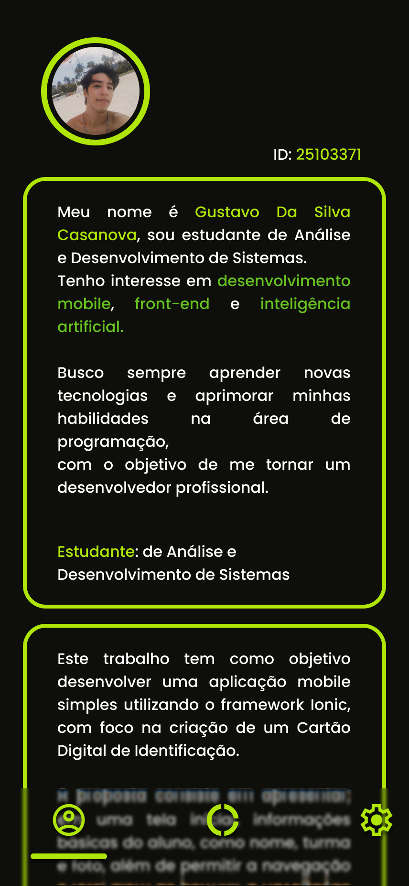
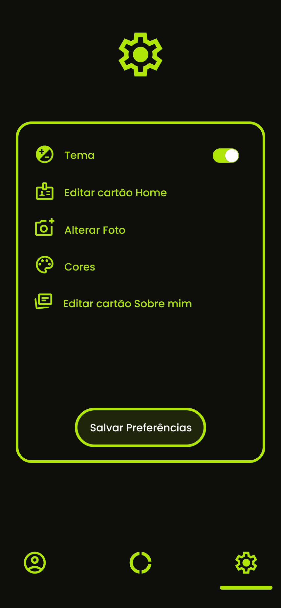
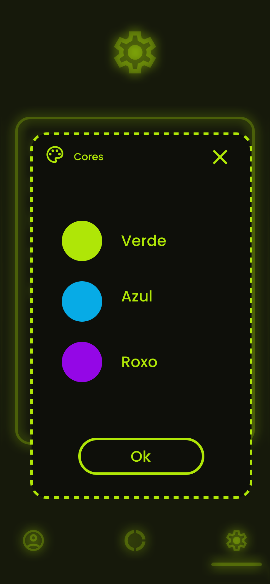

# 🚀 Cartão Digital Ionic

Cartão Digital: Aplicativo mobile desenvolvido com **Ionic** e **TypeScript** que exibe informações pessoais em um cartão digital interativo, com navegação entre telas.


## 📱 Descrição

O **Cartão Digital Ionic** é um aplicativo híbrido desenvolvido com **Ionic** e **Angular**, permitindo apresentar informações pessoais, fotos e detalhes do usuário de forma prática e intuitiva.

O app possui três telas principais:

- **Cartão:** mostra nome, turma/unidade/turno e foto do usuário  
- **Sobre:** apresenta informações adicionais sobre o usuário  
- **Configurações:** permite ajustar as preferências do aplicativo  

O projeto é modular, com componentes reutilizáveis e fáceis de expandir.


## 🛠 Tecnologias Utilizadas

- **Ionic Framework** – desenvolvimento mobile híbrido  
- **Angular** – estrutura de componentes e rotas  
- **TypeScript** – lógica do app  
- **SCSS** – estilos avançados  
- **Capacitor** – integração com recursos do dispositivo  
- **Git & GitHub** – controle de versão  


## ⚡ Funcionalidades

- Visualização do cartão digital com informações do usuário  
- Tela **Sobre** com texto personalizado  
- Tela de **Configurações** para ajustes do app  
- Componentes reutilizáveis e sobreposições customizadas  
- Navegação simples e intuitiva  


## 📸 Capturas de tela

> Adicione suas imagens na pasta `screenshots/` do projeto.

### 💻 Desktop
  
  
  

### 📱 Mobile
  
  
  
  


## 🔗 Links importantes

- **Figma do projeto:** [Clique aqui](https://www.figma.com/design/pr1vACXAWDTqYIHVvBxHDa/Cart%C3%A3o-Digital---Formadora-1--3-per%C3%ADodo-?m=auto&t=iB0JcrVgrpRYZXWD-6)  
- **Documentação PDF:** [Acessar PDF](docs/Formadora-1_Gustavo.pdf)  


## 🚀 Como executar o projeto

```bash
# Clonar o repositório
>>>>>>> recuperar-readme
git clone https://github.com/gcasiv/cartao-digital-ionic.git

# Entrar na pasta
cd cartao-digital-ionic

# Instalar dependências
npm install

# Rodar no navegador (modo desenvolvimento)
ionic serve

Para rodar em dispositivos Android ou iOS, configure o Capacitor e siga os comandos correspondentes.


## 📂 Estrutura do projeto

src/
├── app/
│   ├── componentes/   # Componentes reutilizáveis
│   ├── páginas/       # Telas: home, sobre, configurações
│   ├── services/      # Serviços (ex: overlays)
│   └── app.routes.ts  # Rotas do app
├── assets/            # Imagens e recursos
└── global.scss        # Estilos globais


## 📬 Contato do Desenvolvedor

Nome: Gustavo Casanova
E-mail GitHub: 214485084+gcasiv@users.noreply.github.com
